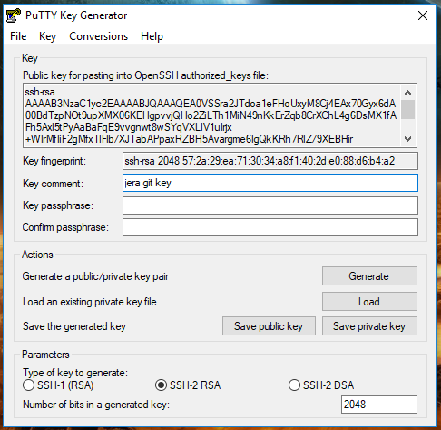

# Git

Git เป็นตัวจัดการ source code หรือ version control ตัวหนึ่งซึ่งเป็นที่นิยมสูงมากมันมีข้อดีหลายอย่าง ถ้าสนใจ ไปหาอ่านกันเอาเองละกัน

# Version Control

ปกติแล้ว เราเขียนแอปพลิเคชันขึ้นมา มันก็จะมีการแก้ไข เปลี่ยนแปลงตามกาลเวลา ซึ่งตามปกติ ถ้าเกิดพัฒนาเพิ่มเติม แล้วมันแย่กว่าเดิมล่ะ หรือทำไปสักพัก พบว่ามันไม่เวิร์คอะไรงี้ 
ถ้าไม่มีเครื่องมือใด ๆ หรือการ backup เอาไว้ การจะย้อนกลับนั้นทำได้ลำบากมาก (ถึงจะมี backup เป็นโฟลเดอร์ เป็นไฟล์ .zip มันก็ไม่ง่าย 
เพราะถ้าจะย้อนแค่บางไฟล์ บางส่วนของไฟล์ล่ะ จะรู้ไหมว่าไฟลไหน หรือส่วนไหน ก็ต้องไล่หาเอง)

แต่ถ้าใช้ version control เราก็จะย้อนกลับไปใช้ code ของเมื่อเช้าที่เราใส่เข้าไปใน repo (repository) ได้ง่าย ๆ

หรือถ้าทำไปสักพัก และ code บางส่วนมันหายไป (ลบพลาดไป) แต่ไฟล์นี้ถูกแก้ไขมาหลายวันแล้ว ไม่รู้หายไปตอนไหนยังไง ก็สามารถไล่ย้อนไปได้ผ่านข้อมูล repo ถ้าอยากจะดึงบางส่วนของไฟล์นั้นมาก็ทำได้

ถ้ามีคนทำงานนี้กันหลายคน ทุกคนสามารถทำงานแยกกันไปได้ จะแก้ไขไฟล์ไหน หรืออะไรยังไงก็ได้ (บนพื้นฐานที่เขียนไปในแนวทางเดียวกัน) เมื่อครบวันก็นำสิ่งที่ทุกคนเขียนมารวมกันได้ง่าย ๆ เพราะมันเก็บความเปลี่ยนแปลงเอาไว้ ทำให้เราพัฒนาแอปพลิเคชันเดียวกันไปพร้อม ๆ กันหลายคนได้สะดวก

# Repository

repository หรือ repo คิดง่าย ๆ ก็คือ แหล่งเก็บ source code นั่นเอง ปกติ 1 project จะต้องมี 1 repo

# Git on the Cloud

เพื่อความสะดวก และปลอดภัย แนะนำให้เก็บ source code ไว้บน cloud โดยมีเว็บที่ให้บริการเก็บ repository ดัง ๆ อยู่ 2 เจ้า คือ 
[Github](https://github.com/) และ [Bitbucket](https://Bitbucket.org/)

Github มีเครื่องมือ อะไรอะไรสะดวกกว่า ชุมชนเข้มแข็งกว่า Bitbucket แต่ Bitbucket มีข้อดีคือ สามารถใช้ private repository ได้ฟรี การใช้งานบนเว็บอาจจะต่างกัน 
แต่ถ้าใช้ผ่าน Git/GitExtensions แล้ว มันไม่ต่างกันเลย

# Github

[Github](https://github.com/) เน้น opensource เป็นหลัก มีชุมชนเข็งแข็ง เครื่องมือหลายอย่างพร้อมเพรียง

# Bitbucket

[Bitbucket](https://Bitbucket.org/) จะอนุญาตให้สร้าง private repo หรือ repo ส่วนตัว ที่อนุญาตให้เฉพาะตัวเอง หรือทีมเข้าถึงได้เท่านั้น 
ในขณะที่ Github ถ้าอยากได้บริการอันนี้ต้องเสียตังค์

# Signed Key

เมื่อสมัครเรียบร้อยแล้ว ก็จะต้องเชื่อมต่อกับ GitExtensions ผ่าน SSH เพื่อความปลอดภัยของข้อมูล ซึ่งทำได้ดังนี้

## Generate Key

ก่อนอื่นต้องสร้าง key ซึ่งจะมี 2 ส่วนคือ public key อันนี้เอาไปประกาศในโลกรู้ ว่า อันนี้คือ (แม่)กุญแจของเรานะ และ private key ซึ่งต้องเก็บให้มิดชิด เพราะมันคือ (ลูก)กุญแจที่เอาไว้ยืนยันกับ public key ว่าเป็นเราจริง ๆ ไม่ใช่คนอื่นปลอมมา

เปิด GitExtensions แล้วไปที่เมนู Tools > PuTTY > Generate or import key จะมีหน้าต่าง PuTTY Key Generator ขึ้นมา ให้คลิกที่ปุ่ม Generate แล้วขยับเมาส์ไปมาในช่อง Key 
จนกว่าแถบแสดงความคืบหน้าจะเต็ม

เมื่อเรียบร้อยแล้ว จะได้ key มาแบบนี้

จะมีช่องที่น่าสนใจคือ

- Public key...: อันนี้จะเป็น public key ที่เอาไปประกาศให้โลกรู้
- Key fingerprint: ข้อมูลแบบย่อของ public key
- Key comment: เอาไว้เตือนตัวเองว่ามันเป็น key เกี่ยวกับอะไร
- **Key passphrase**: อันนี้สำคัญ มันคือ รหัสผ่านที่ไว้เข้าถึง private key ถ้าไม่มี มันจะถอดข้อมูลของ private key ไม่ได้ ทำให้ไม่สามารถใช้เป็นข้อมูลยืนยันกับ public key ได้ **ห้ามลืม**
- **Confirm passphrase**: ใส่ให้เหมือนกันกับ passphrase เป็นการยืนยันว่า เราไม่ได้พิมพ์ผิด

เมื่อกรอกข้อมูลในช่อง comment, passphrase, comfirm passphrase เรียบร้อยแล้วก็บันทึก key ไว้เสีย คลิกที่ปุ่ม Save public key ตั้งชื่อเป็นอะไรก็ได้ ส่วนใหญ่มักจะไม่ใส่นามสกุลไฟล์กัน แต่จะใช้ .key ก็ได้อยู่ (สมมุติเป็น git.key) และก็อย่าลืมคลิก Save private key และเก็บไปที่เดียวกันกับ public key ส่วนนามสกุลมักจะเป็น .ppk (สมมุติเป็น git.ppk) ซึ่งมาจาก PuTTY Private Key นั่นเอง (ถ้าใช้ตัวอื่น gen ก็จะเป็นนามสกุลอื่นนะ แต่เราไม่พูดถึง)

อย่าพึ่งปิดหน้าต่างนี้นะ

**Note**:

- เราจะได้ไฟล์สำคัญ 2 ไฟล์ คือ git.key และ git.ppk เก็บไว้ในที่สำคัญ ห้ามหาย
- รหัสผ่านสำหรับเปิด git.ppk ซึ่งสำคัญห้ามลืมเช่นกัน

*แล้วถ้าหายล่ะ?* ก็ gen key ใหม่ แล้วไปผูกกับระบบใหม่ก็เท่านั้นแหละ

## Sign with Github

เมื่อได้ public key กับ private key มาแล้ว ต่อไปจะผูกมันเข้ากับ Github และ Bitbucket เริ่มจาก Github ก่อน

เริ่มจาก คลิกที่ avatar ของเรา แล้วเลือก Settings

คลิกที่เมนู SSH and GPG keys แล้วคลิกปุ่ม New SSH key 

*ในรูปของผมจะมีอยู่แล้ว 1 key เพราะผมทดลองใช้ Github desktop ดู และพบว่า... GitExtensions เถอะ*

เมื่อคลิกแล้วจะมีช่องให้กรอก ตั้งชื่อของ key ในช่อง Title ส่วนช่อง Key ก็คัดลอดข้อมูลทั้งหมดจากช่อง Public key ในแอป PuTTY Key Generator มาใส่นั่นเอง 
แล้วก็คลิกปุ่ม Add SSH key ทาง Github อาจจะถามรหัสผ่าน**ของ Github** อีกครั้ง (ไม่ใช่รหัสผ่านของ .ppk นะ) ให้กรอกยืนยันไป

*ถ้าปิดไปแล้ว?* เปิด PuTTY Key Generator ขึ้นมา แล้วคลิก Load เลือก git.ppk แล้วกรอกรหัสผ่านเสีย หรือถ้ามั่นใจว่าจำรหัสผ่านได้ ก็หาทางเปิด git.key แล้วคัดลอกมาก็ได้

ก็จะได้แบบนี้ เป็นอันเรียบร้อย

## Sign with Bitbucket

สำหรับ Bitbucket หลังจาก login เข้าไปแล้ว ให้คลิกที่ avatar ของเราที่อยู่มุมล่างซ้าย (ใต้ ?) เลือกเมนู Settings ตามด้วย SSH Keys (ในส่วน Security) และคลิก Add Key 

ส่วนข้อมูลก็กรอกเช่นเดียวกับ Github ช่อง Label เป็นชื่อ และช่อง Public key ก็เอามาจาก PuTTY Key Generator นั่นเอง

ของพวกนี้ อาจจะดูยุ่งยากในตอนเริ่มต้น แต่เมื่อตั้งค่าเรียบร้อยแล้ว เมื่อถึงเวลาใช้งานจริง มันจะง่าย และสะดวกไปหมด คุ้มค่าแน่นอน (ถ้าใช้บ่อย ๆ)

## Extra

*นอกจาก source code แล้ว เก็บอย่างอื่นได้ไหม?*

เก็บได้ แต่ข้อมูลควรเป็น text document หรือข้อความธรรมดา ถ้าเป็นไฟล์ binary อย่างรูปภาพ หรือไฟล์ pdf มันไม่เหมาะ เก็บได้ไหม ก็ได้แหละ แต่ไม่ได้ประโยชน์จาก version control เต็มที่ ถ้าเป็นไฟล์ vector อย่าง .svg ก็พอได้อยู่ ส่วนเอกสารไฟล์งาน (อันนี้แนะนำ revision ของแอปพลิเคชั่นที่ใช้ น่าจะเวิร์คกว่า