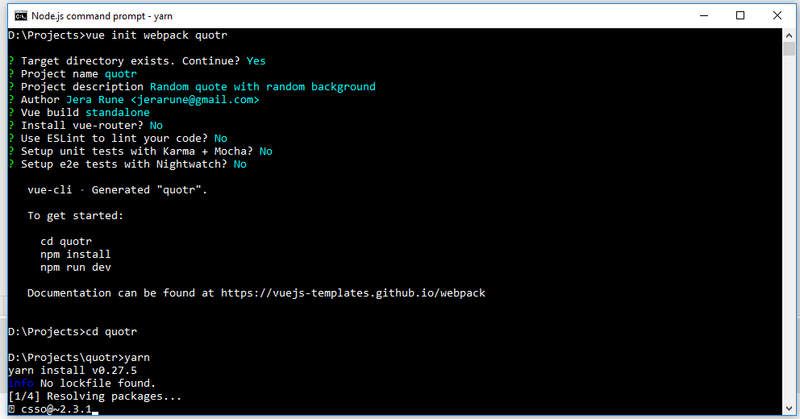
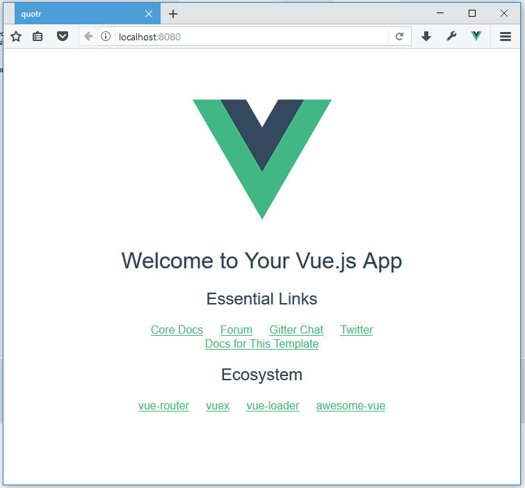

# Random Quote

โปรเจ็คแรก จะทำเว็บที่แสดงคำคมตามสมัยนิยมสักหน่อย

## Project information

ข้อมูลเบื้องต้นของ project นี้ จะให้มาแบบนี้ แล้วต่อไปต้องสร้างขึ้นมาเองโดยจะไม่บอกขั้นตอนอีก

- project name: quotr
- repository name: quotr
- description: Random quote with random background
- vue-router: no
- ESLint: no
- Unit test: no
- e2e test: no

## Create repository

อันนี้ขอข้าม ไปดูรายละเอียดจากบทก่อน ๆ ได้เลย (และถ้าทำตามมาเรื่อย ๆ อันนี้ก็ข้ามไปได้เลย)

## Create a Vue.js project

หลังจากได้ repo เปล่า ๆ มาแล้ว ให้เปิด `Node.js command prompt` ขึ้นมาแล้วไปที่ โฟลเดอร์เก็บ repo ของเรา อย่างของผมเป็น `D:\Projects\`

แล้วก็สั่ง

`vue init webpack [project name]`

โดยเปลี่ยน `[project name]` เป็นที่เราสร้างขึ้นมา อันนี้จะเป็น `vue init webpack quotr`

มันจะถามแจ้งว่ามี directory อยู่แล้ว จะดำเนินการต่อไหม? ให้ตอบ `Y`

ต่อมาจะถามข้อมูลเบื้องต้น อ้างอิงจากข้อมูลข้างต้น

- **Project name** ให้ใช้ชื่อเดียวกับ repo เลยกด `Enter` ผ่าน
- **Project description** ใส่คำอธิบายเกี่ยวกับ project ของเรา `Random quote with random background`
- **Author** ใส่ชื่อของเจ้าของ project พร้อมอีเมลในรูปแบบ `name <email>` โดยค่าเริ่มต้นน่าจะเป็นอันเดียวกับที่ใส่ใน GitExtensions
- **Vue build** อันนี้ใช้ปุ่มลูกศรเลื่อนเพื่อเลือก ให้เลือกเป็น `Runetime + Compiler` ซึ่งมันทำสีให้อยู่แล้ว ก็กด `Enter`
- **Install vue-router?** ตอบ `n`
- **Use ESLint to lint your code?** ตอบ `n`
- **Setup unit tests with Karma + Mocha?** ตอบ `n`
- **Setup e2e tests with Nightwatch?** ตอบ `n`

ตัวระบบจะใส่ข้อมูลในโฟลเดอร์ `quotr` ให้ ต่อไปก็ติดตั้ง packages โดย `cd quotr` เพื่อเปลี่ยน directory และ `yarn` เพื่อติดตั้ง packages ต่าง ๆ

เมื่อเสร็จแล้วให้สั่ง `yarn dev` ระบบจะเริ่มทำงาน และสร้างเซิฟเวอร์ขึ้นมา แล้วเปิดเบราว์เซอร์ไปยัง <http://localhost:8080/> ใด้โดยอัตโนมัติ หากได้ดังนี้ แสดงว่าพร้อมที่จะทำงาน

ทุกครั้งที่ได้แบบนี้ ให้เพิ่มเข้า repo ให้เรียบร้อย เวลามีปัญหาจะได้ย้อนกลับมาเริ่มใหม่ตรงนี้ ไม่ต้องลบแล้วสร้าง project ใหม่ให้ยุ่งยาก

**หมายเหตุ** ในครั้งต่อ ๆ ไปจะไม่อธิบายตรงนี้ซ้ำแล้ว

## Developing

*to be continue*