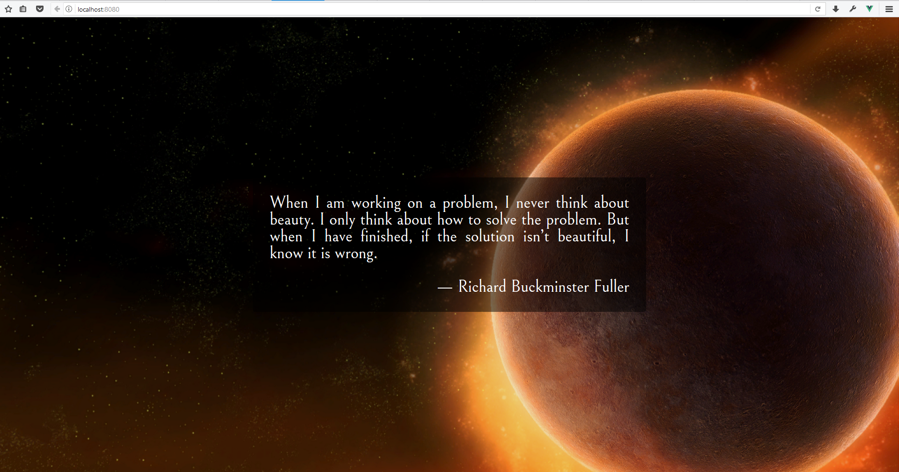

# Random Quote

โปรเจ็คแรก จะทำเว็บที่แสดงคำคมตามสมัยนิยมสักหน่อย

## Project information

ข้อมูลเบื้องต้นของ project นี้ จะให้มาแบบนี้ แล้วต่อไปต้องสร้างขึ้นมาเองโดยจะไม่บอกขั้นตอนอีก

- project name: quotr
- repository name: quotr
- description: Random quote with random background
- vue-router: no
- ESLint: no
- Unit test: no
- e2e test: no

## Create repository

อันนี้ขอข้าม ไปดูรายละเอียดจากบทก่อน ๆ ได้เลย (และถ้าทำตามมาเรื่อย ๆ อันนี้ก็ข้ามไปได้เลย)

## Create a Vue.js project

หลังจากได้ repo เปล่า ๆ มาแล้ว ให้เปิด `Node.js command prompt` ขึ้นมาแล้วไปที่ โฟลเดอร์เก็บ repo ของเรา อย่างของผมเป็น `D:\Projects\`


แล้วก็สั่ง

`vue init webpack [project name]`

โดยเปลี่ยน `[project name]` เป็นที่เราสร้างขึ้นมา อันนี้จะเป็น `vue init webpack quotr`

มันจะถามแจ้งว่ามี directory อยู่แล้ว จะดำเนินการต่อไหม? ให้ตอบ `Y`

ต่อมาจะถามข้อมูลเบื้องต้น อ้างอิงจากข้อมูลข้างต้น

- **Project name** ให้ใช้ชื่อเดียวกับ repo เลยกด `Enter` ผ่าน
- **Project description** ใส่คำอธิบายเกี่ยวกับ project ของเรา `Random quote with random background`
- **Author** ใส่ชื่อของเจ้าของ project พร้อมอีเมลในรูปแบบ `name <email>` โดยค่าเริ่มต้นน่าจะเป็นอันเดียวกับที่ใส่ใน GitExtensions
- **Vue build** อันนี้ใช้ปุ่มลูกศรเลื่อนเพื่อเลือก ให้เลือกเป็น `Runetime + Compiler` ซึ่งมันทำสีให้อยู่แล้ว ก็กด `Enter`
- **Install vue-router?** ตอบ `n`
- **Use ESLint to lint your code?** ตอบ `n`
- **Setup unit tests with Karma + Mocha?** ตอบ `n`
- **Setup e2e tests with Nightwatch?** ตอบ `n`

ตัวระบบจะใส่ข้อมูลในโฟลเดอร์ `quotr` ให้ ต่อไปก็ติดตั้ง packages โดย `cd quotr` เพื่อเปลี่ยน directory และ `yarn` เพื่อติดตั้ง packages ต่าง ๆ


เมื่อเสร็จแล้วให้สั่ง `yarn dev` ระบบจะเริ่มทำงาน และสร้างเซิฟเวอร์ขึ้นมา แล้วเปิดเบราว์เซอร์ไปยัง <http://localhost:8080/> ใด้โดยอัตโนมัติ หากได้ดังนี้ แสดงว่าพร้อมที่จะทำงาน


ทุกครั้งที่ได้แบบนี้ ให้เพิ่มเข้า repo ให้เรียบร้อย เวลามีปัญหาจะได้ย้อนกลับมาเริ่มใหม่ตรงนี้ ไม่ต้องลบแล้วสร้าง project ใหม่ให้ยุ่งยาก

**หมายเหตุ** ในครั้งต่อ ๆ ไปจะไม่อธิบายตรงนี้ซ้ำแล้ว

## Developing

ต่อไปจะเป็นการเริ่มเขียน code ให้เปิด Visual Studio Code (VSCode) ขึ้นมา แล้วไปที่เมนู File > Open Folder... และเลือกโฟลเดอร์ `quotr` ที่เราสร้างไว้

คราวนี้มาดูโฟลเดอร์ และไฟล์ที่น่าสนใจก่อน ในตอนแรก มีอยู่ไม่มากคือ

- `src\` อันนี้เป็นที่เก็บ source code ของเรา ส่วนใหญ่เราจะเขียน แก้ไข code ของเราในโฟลเดอร์นี้ รวมถึงโฟลเดอร์ย่อย
- `src\assets\` จะเก็บไฟล์พวก .css หรือไฟล์รูปภาพต่าง ๆ
- `src\App.vue` จะเป็นไฟล์หลักที่แสดงผลหน้าเว็บ
- `index.html` เป็นไฟล์ใช้เข้าถึงไฟล์อื่น ๆ ของเรา จัดเป็น entry point ของตัว web app

ส่วนที่เหลือ รู้ไว้ใช่ว่า

- `build\` ที่เก็บ script ในการ build สำหรับใช้งานจริง หรือ สร้างเซิฟเวอร์ทดสอบ
- `config\` สำหรับเก็บไฟล์ config ของ project
- `node_modules` เก็บ package ต่าง ๆ ที่ดาวโหลดมาผ่าน yarn
- `static\` เก็บไฟล์ static อย่างรูปภาพ (แต่ตอนนี้เราจะเก็บใน `src\assets\` แทน)
- `packages.json` เป็นไฟล์ตั้งค่าของ node.js สำหรับ project นี้

ที่เหลือไม่ได้ยุ่งมันบ่อย ๆ ไว้เมื่อมันเกี่ยวข้อง จะพูดถึงอีกที

### App.vue

เปิดไฟล์ `src\App.vue` ขึ้นมา ภายในไฟล์จะแบ่งเป็น 3 ส่วนคือ `<template />`, `<script />` และ `<style />` ตามคอนเซ็ปท์ของ Vue ที่เรียกว่า single file component คือการเก็บ code ที่เกี่ยวข้องกันไว้ในไฟล์เดียวกันนั่นเอง

```HTML
<template>
  <div id="app">
    
    <hello></hello>
  </div>
</template>

<script>
import Hello from './components/Hello'

export default {
  name: 'app',
  components: {
    Hello
  }
}
</script>

<style>
#app {
  font-family: 'Avenir', Helvetica, Arial, sans-serif;
  -webkit-font-smoothing: antialiased;
  -moz-osx-font-smoothing: grayscale;
  text-align: center;
  color: #2c3e50;
  margin-top: 60px;
}
</style>
```

สำหรับ project นี้จะแก้ไขแค่ไฟล์นี้ไฟล์เดียว และเฉพาะ `<template />` กับ `<style />` เท่านั้น

#### Layout

เริ่มต้นด้วยการวางโครงสร้างกันก่อน เราต้องคิดก่อนว่า จะให้เว็บออกมาหน้าตายังไง ซึ่งผมต้องการให้มันออกมาแบบนี้



*ภาพ background จากเกม Starcraft II ของ Blizzard ใช้เพื่อการศึกษาเท่านั้น*

มองออกไหม ว่าควรจะจัดวาง layout อย่างไร มี tag ไหนบ้างที่เกี่ยวข้อง

*to be continue...*