# Repository

Repository หรือ Repo เป็นแหล่งเก็บ source code ของเรา ซึ่งเราจะใช้ Git และเก็บไว้บนคลาวด์ที่ Github หรือ Bitbucket

อันที่จริง จะสร้าง repo บนเครื่องเรา โดยไม่เก็บบนคลาวด์ก็ได้ แต่อยากให้เก็บบนคลาวด์ไว้มากกว่า

ซึ่งมี 2 วิธีคือ

1. สร้าง repo บนคลาวด์ แล้ว clone repo นั้นมาบนเครื่องเรา
2. สร้าง repo บนเครื่องเรา และสร้าง repo บนคลาวด์ และเชื่อมันเข้าด้วยกัน

## Cloud First

การสร้าง repo บนคลาวด์ก่อน จะลดความยุ่งยากในการผูก repo เข้าไฟล์บนเครื่องเราได้มากกว่า

### Github

เริ่มต้นจากคลิกที่เมนู `+` แล้วเลือก **New repository**

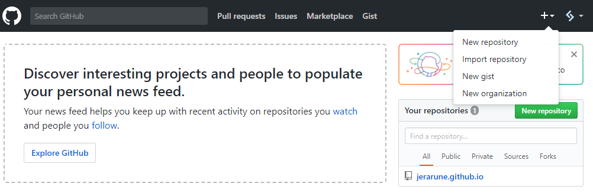

ตั้งชื่อ repo หรือชื่อ project ของเราในช่อง **Repository name** เลือกเป็น **Public** ที่เหลือสามารถปล่อยว่างไว้ได้เลย แล้วคลิก **Create repository**

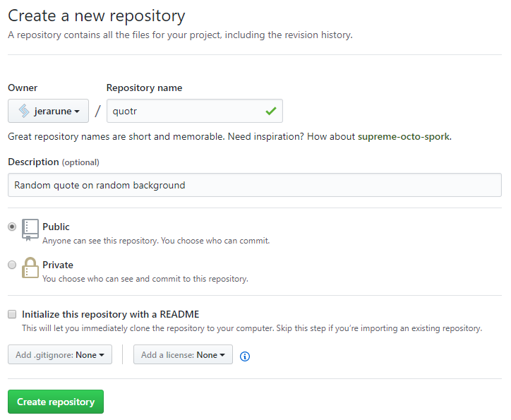

ทุกอย่างก็เสร็จเรียบร้อย จะได้ดังนี้

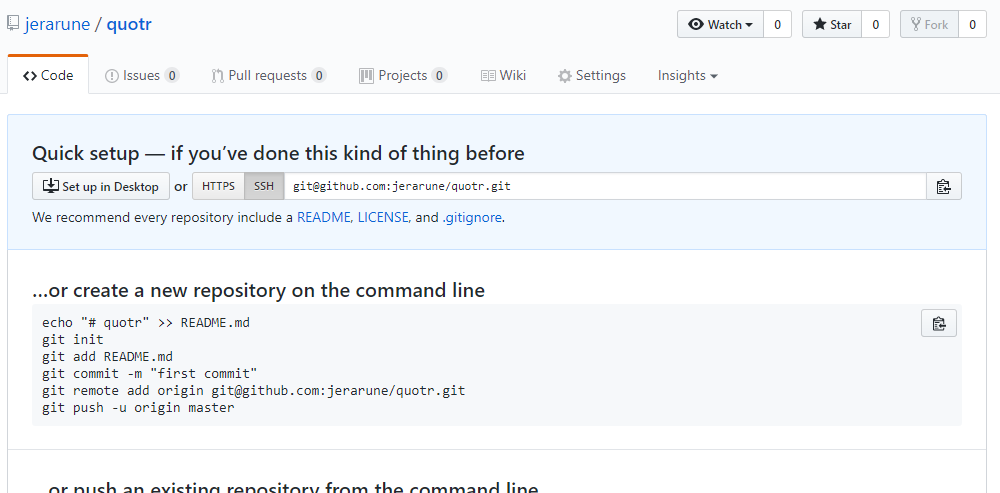

ตอนนี้เราจะได้ repo เปล่า ๆ เอาไว้เก็บ code ของเราแล้ว โดยมีสิ่งที่ควรต้องใส่ใจคือ

ในช่อง Quick setup จะมีช่องพร้อมตัวเลือก HTTPS/SSH พร้อมกับ SSH ที่ถูกเลือกอยู่ และข้อความที่ขึ้นต้นด้วย `git@github.com...` อยู่ อันนี้เป็น **ที่อยู่ repo** ของเรา ซึ่งเราจะใช้อ้างอิงกับ GitExtensions อย่างอันนี้จะเป็น `git@github.com:jerarune/quotr.git` นั่นเอง

### Bitbucket

ขั้นตอนไม่ต่างจาก Github มากนัก เริ่มจากคลิก `+` ที่อยู่ซ้ายมือในหน้า Bitbucket

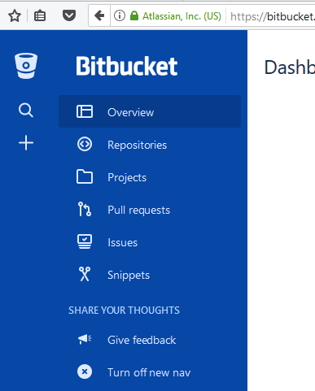

จะเปิดเมนู Create a new ขึ้นมาเลือก Repository

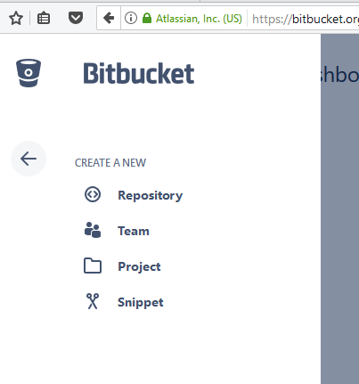

ก็ให้กรอกข้อมูลเกี่ยวกับ repo ของเราลงไป เหมือนกับที่ Github แต่ดูด้วยว่า Repository type เป็น Git หรือไม่

ส่วน Advanced settings ที่น่าสนใจสำหรับ Bitbucket คือจะสามารถเลือก Language ได้ด้วย ให้เลือก Node.js ไป เพราะเราใช้ Node.js ในการพัฒนา ถ้าใช้ภาษาอื่น หรือเครื่องมืออื่น ก็เลือกตามนั้น ประโยชน์คือ มันจะสร้าง icon สวย ๆ ให้กับ repo เรา... (อืม แค่นั้นแหละ)

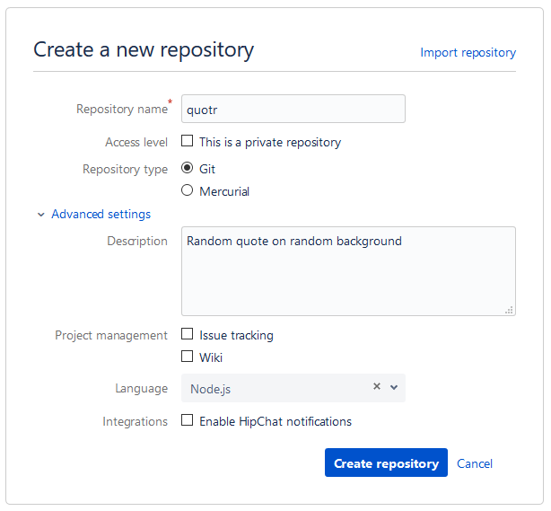

เรียบร้อยแล้วก็คลิก Create repository

เมื่อสร้างเสร็จแล้ว Bitbucket จะแสดงหน้าข้อมูลเกี่ยวกับ repo ขึ้นมา

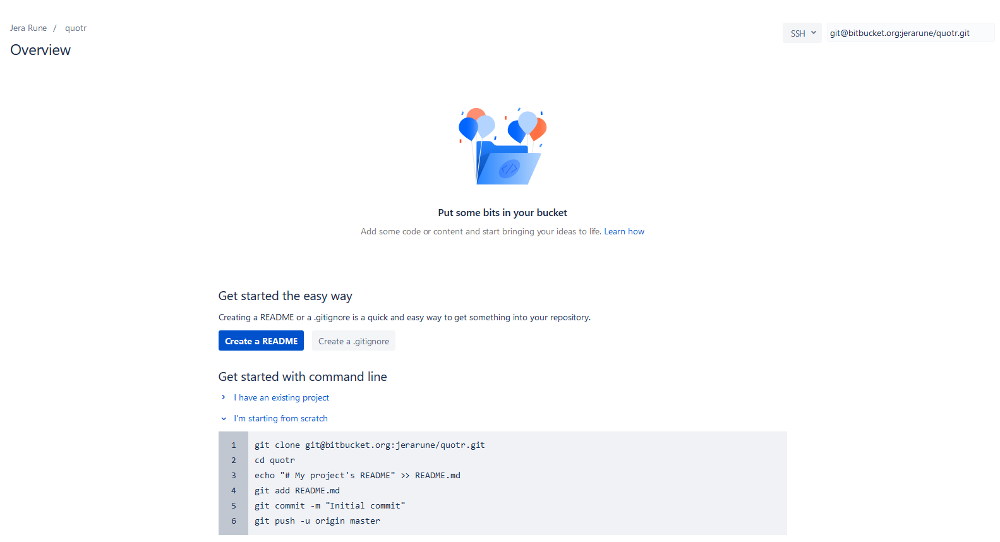

เช่นเดิม ด้านมุมขวาบน จะแสดง **ที่อยู่ repo** ให้ ในตัวอย่างจะเป็น `git@butbucket.org:jerarune/quotr.git`

### Clone with GitExtensions

เมื่อได้ repo เปล่ามา ๆ มาแล้ว ก็ผูกมันไว้กับเครื่องเรา โดยเปิด GitExtensions ขึ้นมา

คลิกที่ `Clone repository` ในส่วน Common Actions จะมีหน้าต่าง Clone ขึ้นมา

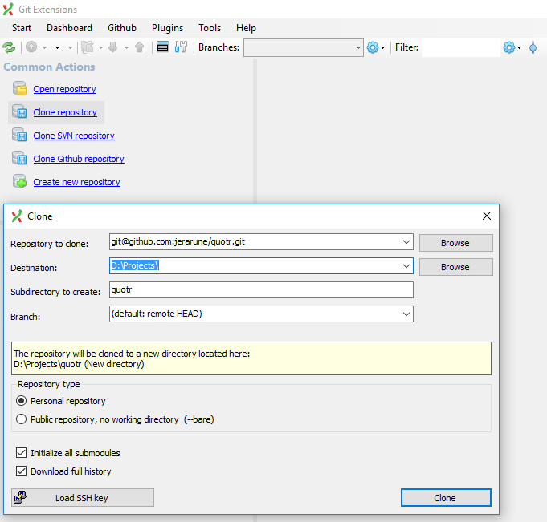

- **Repository to clone** ให้ใส่ **ที่อยู่ repo** ที่ได้จาก Github หรือ Bitbucket ลงไป
- **Destination** ให้ใส่ที่เก็บไฟล์ project ต่าง ๆ ของเรา
- **Subdirectory to create** อันนี้เป็นโฟลเดอร์ของ repo เรา ซึ่งจะเก็บไว้ในโฟลเดอร์ที่ได้จาก **Destination** อีกที

ใส่ครบแล้วให้คลิกปุ่ม **Load SSH key** แล้วเลือกไฟล์ private key (git.ppk) ที่สร้างไว้ในบทก่อนหน้าขึ้นมา ทาง PuTTY จะถามหารหัสผ่านให้กรอกลงไป

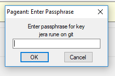

หลังจากนั้นก็คลิกปุ่ม Clone แล้ว GitExtensions จะดาวโหลดข้อมูลมาให้ (ซึ่งมันว่างเปล่า...)

ในกรณีที่ไม่เคยเชื่อมต่อ มันจะหน้าต่างให้ยืนยัน fingerprint ให้ตอบ Yes ไป แล้วระบบจะเช็คข้อมูล ถ้าทุกอย่างถูกต้องจะแจ้งว่า `Shell disabled` บนหน้า command prompt สามารถปิดหน้าต่าง command prompt ได้เลย

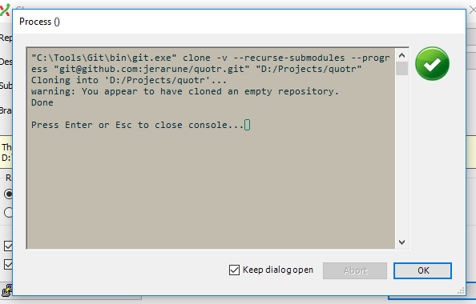

เมื่อเสร็จก็คลิก OK ปิดไป จะถามว่าให้เปิด repo ขึ้นมาไหม ก็เปิดเลย

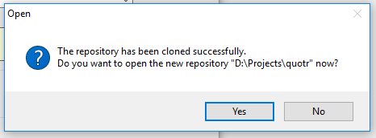

เราจะได้ repo เปล่า ๆ บนเครื่องเราแบบนี้

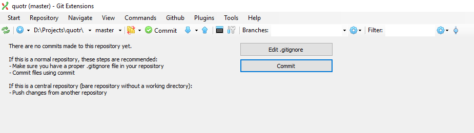

เนื่องจากตอนที่ clone ตัว GitExtensions ไม่ได้จำที่อยู่ private key ไว้ ให้ตั้งค่าให้จำได้โดยไปที่เมนู Repository > Remote repositories...

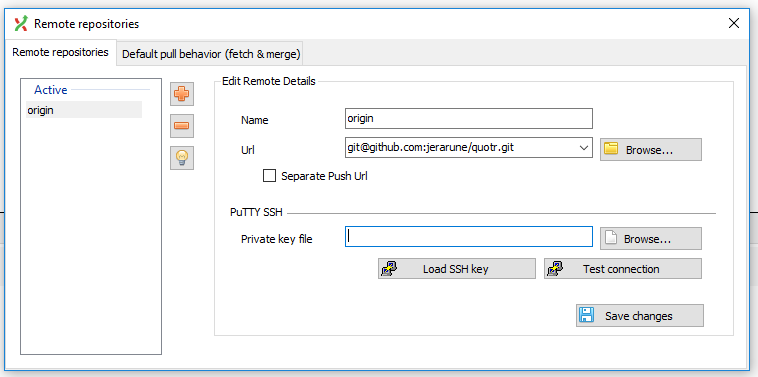

ในช่อง **Private key file** ให้เลือกไฟล์ private key (git.pkk) ขึ้นมา แล้วคลิก `Load SSH key` เพื่อกรอกรหัสผ่าน แล้วคลิก `Test Connection` เพื่อทดสอบว่าทุกอย่างถูกต้อง

หลังจากนั้นให้คลิก `Save changes` และปิดหน้าต่างนี้ได้เลย

## Local First

ถ้าจะสร้าง repo บนเครื่องเราก่อน แล้วค่อยอัพขึ้นคลาวด์ ก็คลิกที่ **Create new repository** ในเมนู Common Actions ใส่โฟลเดอร์ที่จะเก็บ repo ลงไป แล้วคลิกปุ่ม **Create** ทุกอย่างก็เสร็จเรียบร้อย

ต่อไป ก็เชื่อมต่อกับ Github/Bitbucket โดยไปที่เมนู Repository > Remote repositories...

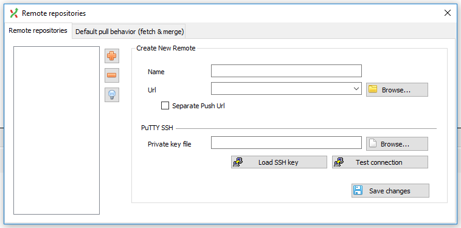

ถ้าหากยังไม่มี repo บน Github/Bitbucket ก็สร้างมันขึ้นมาก่อน แล้วเอาข้อมูลมากรอกดังนี้

- **name** ส่วนใหญ่จะใช้ origin ในกรณีที่เก็บไว้ที่เดียว แต่ถ้าหลายที่ จะตั้งชื่อแยกกันเช่น github หรือ bitbucket ก็ได้ตามสะดวก
- **Url** จะเป็นที่อยู่ของ Git ถ้าตามในนี้คือ `git@github.com:jerarune/quotr.git` (หรือ `git@butbucket.org:jerarune/quotr.git`)

ในช่อง **Private key file** ให้เลือกไฟล์ private key (git.pkk) ขึ้นมา แล้วคลิก `Load SSH key` เพื่อกรอกรหัสผ่าน แล้วคลิก `Test Connection` เพื่อทดสอบว่าทุกอย่างถูกต้อง

ในกรณีที่ไม่เคยเชื่อมต่อ มันจะหน้าต่างให้ยืนยัน fingerprint ให้ตอบ Yes ไป แล้วระบบจะเช็คข้อมูล ถ้าทุกอย่างถูกต้องจะแจ้งว่า `Shell disabled` บนหน้า command prompt สามารถปิดหน้าต่าง command prompt ได้เลย

หลังจากนั้นให้คลิก `Save changes` จะมีหน้าต่างถามว่าให้ config อัตโนมัติให้ไหม ให้ตอบ Yes ไปเลย ระบบจะโหลดข้อมูลนิดหน่อย หากไม่มีปัญหาอะไรก็สามารถปิดหน้าต่างนี้ได้เลย

# Create a Vue.js project

หลังจากได้ repo เปล่า ๆ มาแล้ว ให้เปิด `Node.js command prompt` ขึ้นมาแล้วไปที่ โฟลเดอร์เก็บ repo ของเรา อย่างของผมเป็น `D:\Projects\`

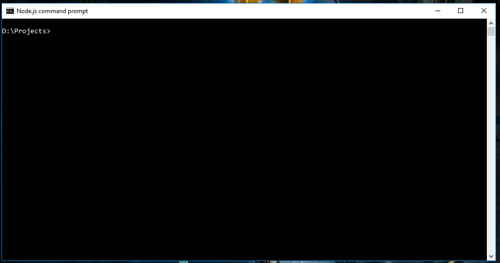

แล้วก็สั่ง

`vue init webpack [repo name]`

โดยเปลี่ยน `[repo name]` เป็นที่เราสร้างขึ้นมา อันนี้จะเป็น `vue init webpack quotr`

มันจะถามแจ้งว่ามี directory อยู่แล้ว จะดำเนินการต่อไหม? ให้ตอบ `Y`

ต่อมาจะถามข้อมูลเบื้องต้นดังนี้

- **Project name** ให้ใช้ชื่อเดียวกับ repo เลยกด `Enter` ผ่าน
- **Project description** ใส่คำอธิบายเกี่ยวกับ project ของเรา สั้น ๆ ถ้าขี้เกียจก็ `Enter` ผ่าน มันจะใส่เป็น *A Vue.js project* โดยอัตโนมัติ
- **Author** ใส่ชื่อของเจ้าของ project พร้อมอีเมลในรูปแบบ `name <email>` โดยค่าเริ่มต้นน่าจะเป็นอันเดียวกับที่ใส่ใน GitExtensions
- **Vue build** อันนี้ใช้ปุ่มลูกศรเลื่อนเพื่อเลือก ให้เลือกเป็น `Runetime + Compiler` ซึ่งมันทำสีให้อยู่แล้ว ก็กด `Enter`
- **Install vue-router?** อันนี้ project แรกตอบ `n` ไปก่อน (ส่วนโปรเจ็คไหนจะให้ต่างจากนี้ จะบอกอีกที)
- **Use ESLint to lint your code?** เป็นการเช็คความถูกต้อง สวยงามของโค้ด มือใหม่ตอบ `n` ไปก่อน ไม่งั้นจะเครียดได้
- **Setup unit tests with Karma + Mocha?** ขอข้ามเรื่องการทำ unit tests ไปก่อน ตอบ `n`
- **Setup e2e tests with Nightwatch?** ตอบ `n` เช่นกัน

ตอนนี้ folder project เราก็มีข้อมูลพร้อมที่จะเริ่มทำงานแล้ว

## Commit to repository

แต่ก่อนจะเริ่มทำงาน เก็บข้อมูลตอนนี้ไว้ก่อน โดยการ commit เข้า repo

ให้กลับไปที่ GitExtensions จะเห็นว่ามีไฟล์เพิ่มเข้ามา สังเกตได้จากทูลบาร์คำสั่ง Commit พร้อมกับ icon สีส้ม ๆ

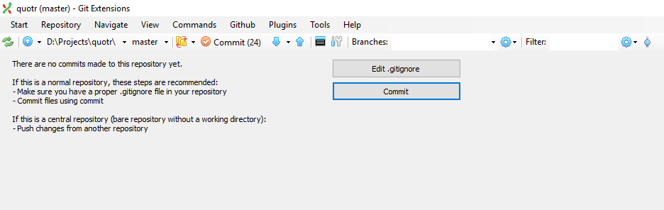

ให้คลิกตรง Commit แล้วจะมีหน้าต่าง Commit เปิดขึ้นมา

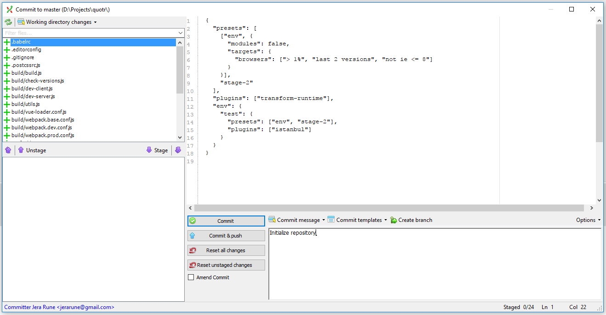

ในหน้านี้ จะแสดงไฟล์ที่ถูกเพิ่ม หรือแก้ไขอยู่ในช่อง **Working directory changes** และข้อมูลการแก้ไขในช่องด้านขวามือ ก่อนที่จะ commit จะต้อง stage ไฟล์ก่อน ให้เลือกไฟล์ทั้งหมด หรือจะคลิกที่ Stage all (ปุ่มที่อยู่ข้าง ๆ Stage) เลยก็ได้ (ในตอนนี้ เราไม่มีไฟล์ที่สำคัญไม่ควรเก็บเข้า repo ดังนั้น Stage all ได้เลย หากมีไฟล์ไหนที่สร้างเล่น ๆ ชั่วคราว แล้วดันติดมาด้วย หากไม่ต้องการลบ ก็อย่า stage เก็บเข้า repo ละกัน)

ในช่อง Commit message ใส่ข้อความอะไรก็ได้ ไม่ต้องยาวมาก แต่ให้รู้ว่า commit นี้เกี่ยวกับอะไร ทำอะไรไป เป็นต้น

เช็คความถูกต้อง แล้วก็คลิก Commit ได้เลย (หรือถ้าจะอัพโหลดขึ้น Github/Bitbucket ก็คลิก Commit & push ได้เช่นกัน)

##### คำสั่ง DOS ที่ควรรู้

- `[Drive]:` สั่งเปลี่ยน drive เช่น อยู่ drive c: อยู่จะไป drive d: ก็สั่ง `D:`
- `cd [directory name]` สั่งเข้าโฟลเดอร์ที่ทำงาน เช่นอยู่ d:\ อยู่จะเข้าโฟลเดอร์ `Projects` ก็สั่ง `cd Projects`

