# Setup your developer environment

อันนี้จะเกี่ยวกับการติดตั้งโปรแกรม แอปพลิเคชันต่าง ๆ ที่จำเป็น (และอาจจะไม่จำเป็น) เพื่อใช้ในการเขียนโค้ด 
หลัก ๆ ก็จะเป็น Code Editor หรือ ตัวแก้ไข source code เครื่องมือในการพัฒนาต่าง ๆ และโปรแกรมจัดการ source code

## แอพพลิเคชั่นที่จำเป็น

- Visual Studio Code (Code Editor)
- Node.js (JavaScript Runtime Library)
- Yarn (Package Manager)
- GitExtensions (Tools fro Source Control)

## Visual Studio Code

[Visual Studio Code](https://code.visualstudio.com/) เป็นเครื่องมือหลักในการเขียน (พิมพ์) โค้ด ที่จะใช้สอน สาเหตุหลัก ๆ คือ มันฟรี ทำได้ครบถ้วนเท่าที่ต้องการ (แต่มันมีดีกว่านั้น) 
มีให้เลือกเป็นแบบ Stable (เสถียร) และ Insiders (ทดสอบ) และมีแบบ 32bit และ 64bit 
ส่วนตัว ถ้าใช้ Windows 64bit อยู่ก็แนะนำเป็น 64bit แต่โดยทั่วไปแล้วไม่ต่างกันหรอก ใช้ตัวไหนก็ได้

สามารถดาวโหลดได้จาก <https://code.visualstudio.com/>

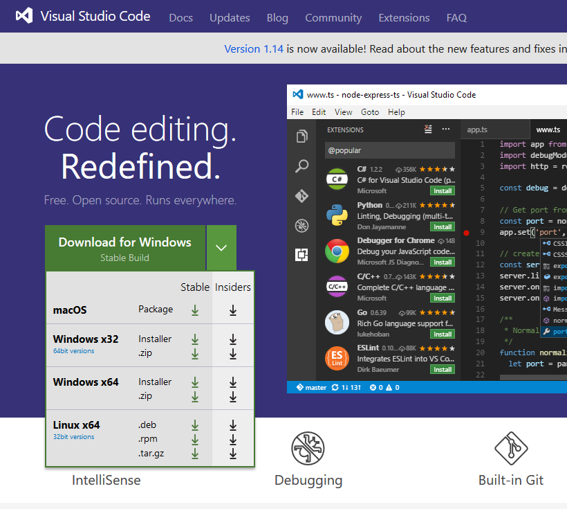

ส่วนการติดตั้งไม่ยุ่งยาก คลิก Next, Next and Next

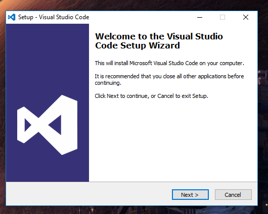

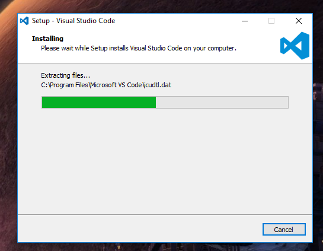

## Node.js

[Node.js](https://nodejs.org/en/) เป็น JavaScript Runtime Library มันเป็น Runtime Library นั่นคือ มันใช้ภาษา JavaScript ในการพัฒนา 
แต่มันทำได้มากกว่าเป็น JavaScript ที่ทำงานบนเว็บไซต์ เพราะนอกเหนือจากใช้งานบนเว็บไซต์ตามปกติแล้ว 
มันสามารถใช้เขียนแอปพลิเคชันสำหรับ desktop (อย่างเช่น Visual Studio Code) ทำงานบนเซิร์ฟเวอร์ หรือมือถือก็ได้ (ตราบใดที่มีเครื่องมือรองรับ)

ดาวโหลดได้จาก <https://nodejs.org/en/>

เลือกเป็น Current version นะ

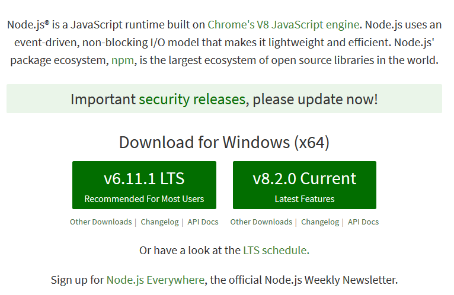

การติดตั้งไม่มีอะไรยุ่งยาก แต่แนะนำให้ติดตั้งไว้ที่ **C:\Tools\nodejs\\** แทนที่ *Program files* เพื่อป้องกันปัญหาเวลาเรืยกใช้ผ่าน command line (ช่องว่างใน path)

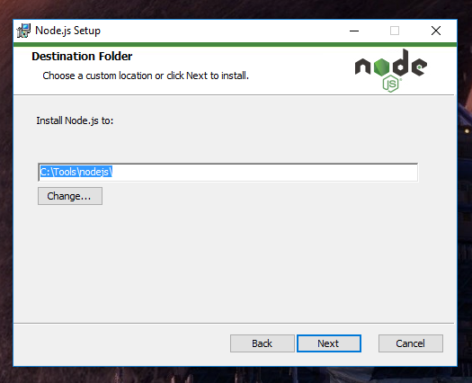

ส่วนฟีเจอร์ที่ต้องการก็ลงให้ครบตามนี้

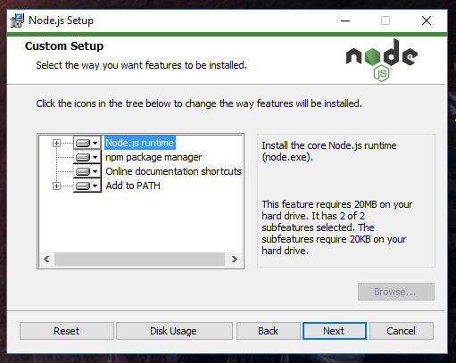

## Yarn

[Yarn](https://yarnpkg.com/en/) เป็น package manager (ที่ทดแทน npm ของ Node.js) มันช่วยให้เราติดตั้ง package หรือ module ต่าง ๆ ที่คนอื่นเขียนไว้แล้ว และนำมาใช้กับงานของเราได้สะดวก ๆ 
ทำให้พัฒนาอะไรได้เร็วขึ้นมาก

ดาวโหลดได้จาก <https://yarnpkg.com/en/docs/install>

*ก่อนจะติดตั้ง Yarn ติดตั้ง Node.js ก่อนนะ*

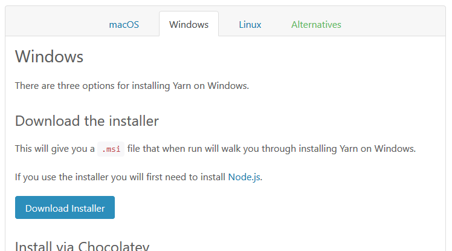

และเช่นเดียวกับ Node.js แนะนำให้ติดตั้งไว้ที่ **C:\Tools\Yarn\\**

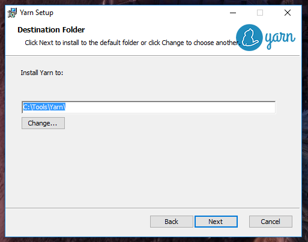

## GitExtensions

[GitExtensions](http://gitextensions.github.io/) เป็นเครื่องมือใช้ในการจัดการ Git ซึ่งเป็น version control หรือ source code manager ตัวหนึ่ง ซึ่งเป็นที่นิยมกันมาก (มันดีมากด้วยล่ะ) 
แต่การใช้งาน Git ด้วย command line มันซับซ้อนเกินไป เลยอยากให้ใช้ตัวนี้แทน (เท่าที่ใช้มา ยังหาตัวอื่นที่ดีกว่านี้ไม่ได้เลย)

และยังมีความสะดวกอีกอย่างคือ GitExtensions รวมเครื่องมือที่เกี่ยวข้องกับการจัดการ source code มาให้พร้อม (ทำให้การตัดตั้งซับซ้อนนิดนึง)

ดาวโหลดได้จาก <https://github.com/gitextensions/gitextensions/releases/latest>

เวลาจะดาวโหลด แนะนำให้เลือก **GitExtensions-?.?.?-SetupComplete.msi** เพราะจะได้เครื่องมืออื่น ๆ มาครบ สะดวกที่สุด

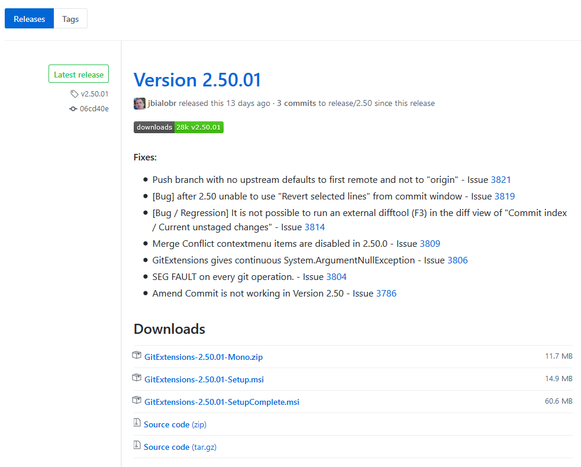

ระดับการตัดตั้งในเครื่องเลือกเป็น All Users ไปเลย

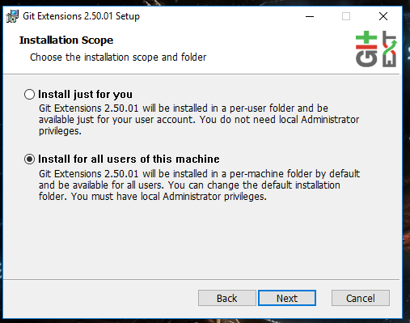

อีกหน้าจะเป็นแอปพลิเคชันที่จำเป็นต้องมี นั่นก็คือ Git (source control) และ KDiff (เปรียบเทียบ source) ก็ติ๊กถูกทั้งสองตัวเลย จะได้ไม่ต้องหามาติดตั้งเองให้ลำบาก

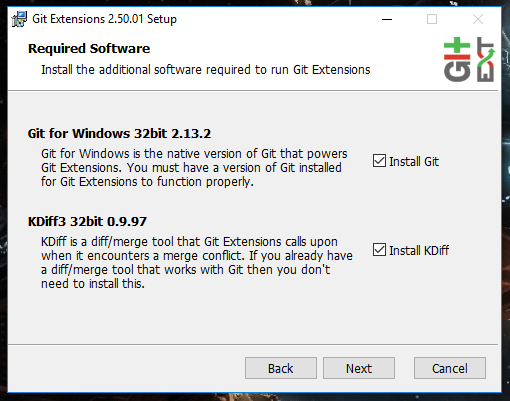

ส่วน feature ที่ต้องใช้ ผมติดตั้ง Extra application icons เพิ่ม (ก็ไม่เคยเปลี่ยนหรอก แต่มีให้เลือกเล่นก็ดี...) และปิด **Windows Explorer integration** (คลิกขวา แล้วรายการมันยาว เห็นแล้วหงุดหงิด) กับ **Visual Studio extension** (ไม่ได้ใช้) ทิ้งไป

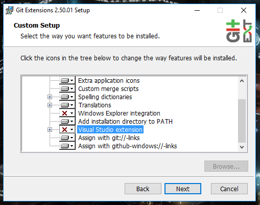

อันนี้เป็น client สำหรับ SSH ให้เลือกเป็น Putty ละกัน (มันทำให้เกือบทั้งหมด แทบจะไม่ได้ใช้เองหรอก)

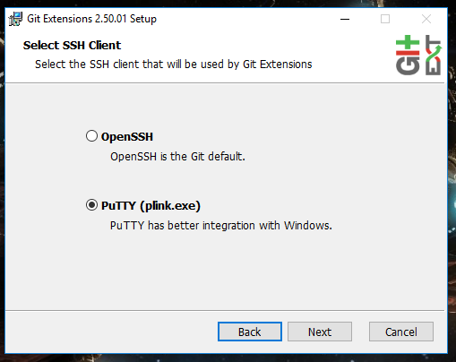

ต่อไปตัว setup จะเรียกตัว setup อื่น ๆ ขึ้นมา เริ่มต้นจาก **Git**

ส่วนตัวผมไม่มีปัญหาเกี่ยวกับจากติดตั้งไว้ที่ **C:\Program Files\Git\\** แต่ถ้าจะย้ายมาที่ **C:\Tools\Git\\** ก็ไม่ว่ากัน

ในส่วนของ feature เช่นเดิม ผมปิด **Windows Explorer integration**

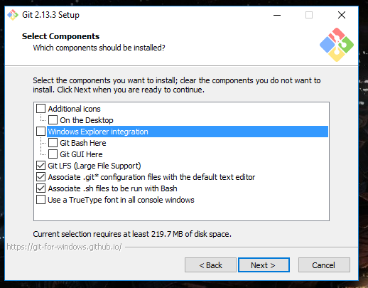

ในหน้า PATH เลือก Use Git from the Windows Command Prompt ไว้เหมือนเดิม (แต่ปกติเราจะทำงานผ่าน GitExtensions เสียมากกว่า)

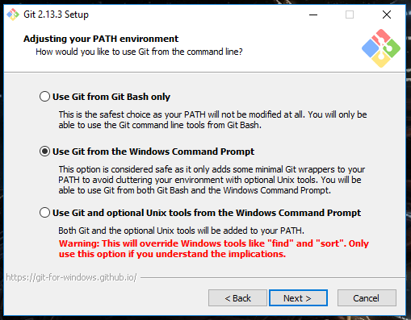

ส่วน HTTPS อันนี้ใช้ library ของ OpenSSL ไปเลย (ถ้าต้องการเชื่อมต่อกับแหล่งเก็บโค้ดขององค์กรต้องเลือกเป็น Use the native Windows Secure Channel library นะ)

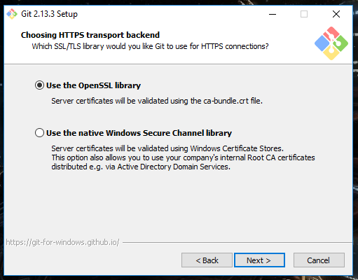

หน้านี้เป็นการเลือก Line Ending ของไฟล์ source code ในการเก็บข้อมูล แนะนำให้เป็น Checkout as-is, commit Unix-style line endings เพราะตามปกติ จะพยายามใช้ line endings ตาม Unix หมดเลย (นั่นคือ LF หรือ \n)

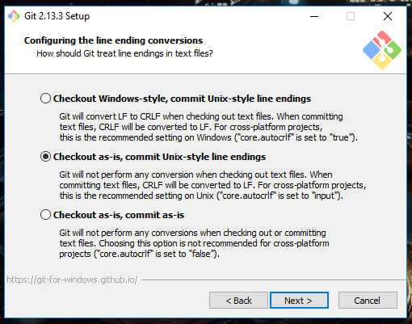

Terminal ใช้เป็น MinTTY (ไม่ต้องห่วงเราใช้ GitExtensions เป็นส่วนใหญ่)

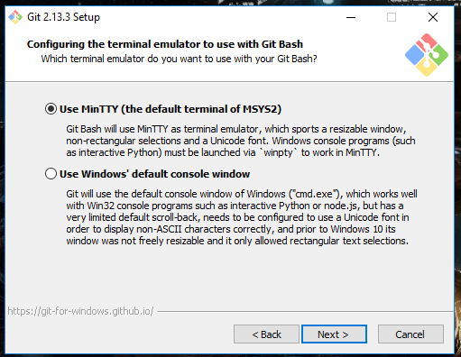

หน้านี้ทิ้งไว้แบบนี้เลย ดีแล้ว

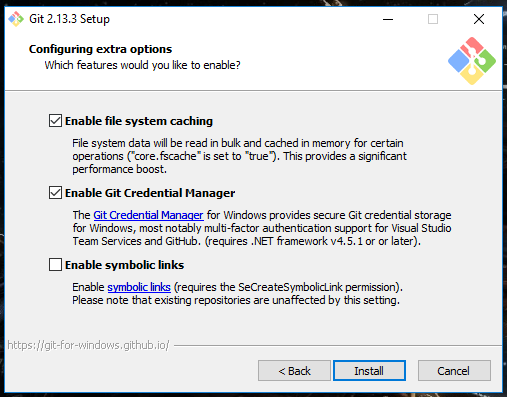

หลังจากติดตั้ง Git เสร็จ ตัว setup จะเรียกตัวติดตั้ง KDiff ขึ้นมา และก็เช่นเดิม เอา **Integration** ออกเสีย

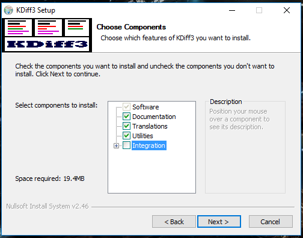

ทุกอย่างเป็นอันเรียบร้อย

## Visual Studio Code Configuration

อย่างที่บอกไปว่าเราจะใช้ line ending เป็น LF หรือ \n ดังนั้น ต้องมาตั้งค่า VSCode สักหน่อย

โดยที่หลักจากเปิด VSCode ขึ้นมาให้ไปที่เมนู File > Preferences > Settings

แล้วค้นหา *eol* แล้วเอาเมาส์ไปชี้ที่บรรทัด **"files.eol": "\r\n",** จะมี **ปุ่มดินสอ** ขึ้นมา ให้คลิกที่ปุ่มดินสอ แล้วเลือกเป็น **\n** แทน

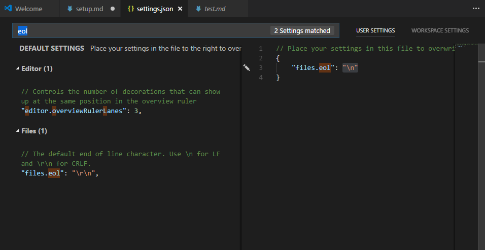

ส่วนการตั้งค่าอื่น ๆ นึกได้แล้วจะบอกเพิ่มเติมทีหลัง

## Visual Studio Code Extensions

มันมี extension ที่จำเป็นอยู่หลายตัว แต่แนะนำให้ติดตั้งจะมี

- Auto Close Tag
- Auto Rename Tag
- language-stylus
- npm Intellisense
- Path Intellisense
- Vetur
- vue

สามารถติดตั้งได้โดยคลิกที่เมนู Extensions ได้เลย และพิมพ์ค้นหาจากช่องค้นหาด้านบนรายการได้ทันที

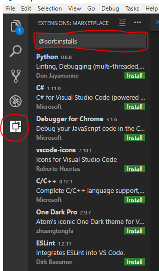

ส่วนการติดตั้ง ก็คลิกที่ปุ่ม Install ถ้าเกิดมีหลายตัวมีชื่อเดียวกัน ให้เลือกอันที่ยอดดาวโหลดสูง ๆ เข้าไว้

ให้ลงครบทุกตัวก่อน แล้วค่อยคลิกปุ่ม Reload (ของ extension ตัวไหนก็ได้) จะได้ไม่ช้า

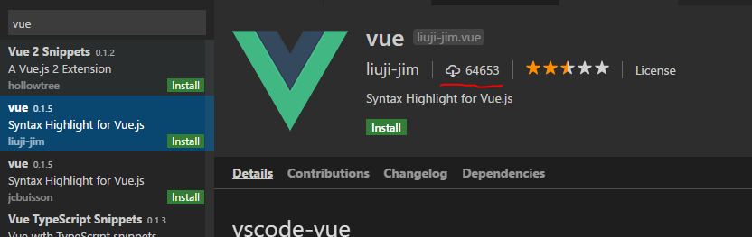

## GitExtensions Configuration

อีกตัวที่ต้องตั้งค่า คือ GitExtensions ให้เปิด GitExtensions ขึ้นมาแล้วไปที่เมนู Tools > Settings และเลือกหัวข้อ GitExtensions ด้านซ้าย

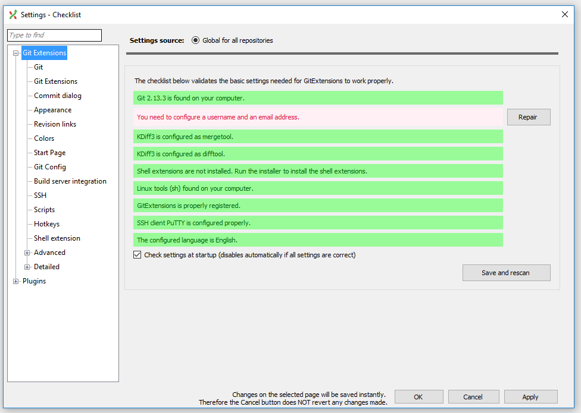

หน้าที่จะเป็นรายการเช็คความถูกต้อง ส่วนใหญ่จะเขียว หรือแต่ไม่ได้ใส่ชื่อ กับอีเมล ก็คลิก Repair แล้วใส่ให้ครบถ้วน

ที่สำคัญจะเป็นช่อง **User name** และ **User email** ใส่ชื่อ และอีเมลเราลงไป มันจะประกาศว่าใครเป็นคนเขียนโค้ดส่วนนี้ (จะได้ตามด่าถูก...)

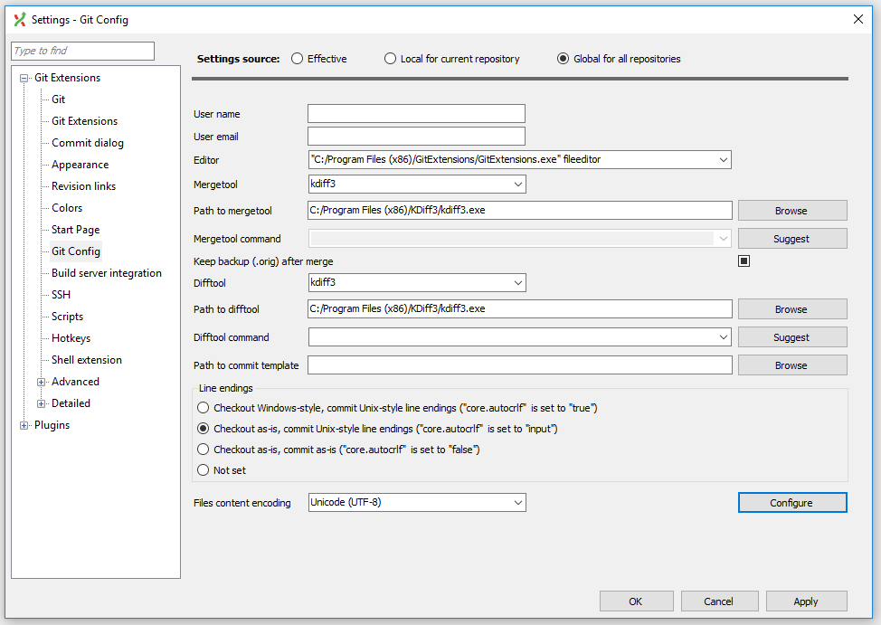

ส่วนที่เหลือ ก็จะเป็น *Line endings* ให้เลือก *Checkout as-is, commit Unix-style line ending...*

และ *File content encoding* เป็น *Unicode (UTF-8)* คลิก Apply ก็เรียบร้อย

## Ask

มีอะไรไปไม่ถูกยังไงสอบถามโลด